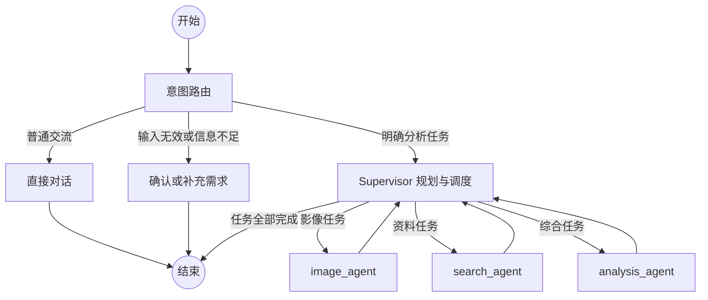

# 雄安城市治理多智能体系统

这是一个面向城市建设、区域发展和遥感变化分析的 LangGraph 多智能体应用。系统既支持普通中文对话，也能把复杂分析需求拆解为影像获取、网络调研和综合分析任务，并通过中文 Web 界面展示执行过程、工具调用与历史会话。

当前推荐的运行方式是：

- LangGraph API：`xiongan_frontend/`
- 中文 Chat UI：`xiongan_frontend/ui/`
- 对话历史：服务端 SQLite
- 网页搜索：百度 AI Search
- 网页正文提取：官方 `mcp-server-fetch` 实现
- 模型：局域网 vLLM，无法连接时可回落到硅基流动

## 主要能力

- **普通对话**：问候、询问身份和一般交流会直接自然回复，不启动复杂分析流程。
- **需求确认**：对纯数字、乱码、空内容或信息不足的请求，会先询问用户是否输错或需要补充什么。
- **任务规划**：对明确的城市分析任务生成有顺序的执行计划。
- **卫星影像获取**：`image_agent` 负责定位区域、获取不同时期影像和地图资料。
- **联网资料调研**：`search_agent` 负责搜索、筛选、抓取正文、生成摘要并保留来源。
- **综合报告生成**：`analysis_agent` 汇总影像与搜索结果，输出分析报告。
- **历史会话恢复**：SQLite checkpoint 保证重启 LangGraph 服务后仍能打开历史对话内容。
- **局域网访问**：前后端均可监听所有网卡，供同一局域网中的设备访问。
- **中文界面**：历史对话、工具调用、复制、编辑、刷新和错误信息等界面文本均已中文化。

## 系统架构



当前任务由 Supervisor 按计划顺序执行。一次需求如果被拆成多个搜索任务，每个搜索任务最多进行 3 轮检索，因此完整报告的生成时间会明显长于普通对话。

## 目录结构

```text
skill_aicoding/
├── .env                                  # 后端环境变量，不提交 Git
├── README.md
├── xiongan_agent/
│   ├── model_probe.py                    # 探测局域网 vLLM，配置模型回退
│   ├── supervisor_agent/
│   │   └── supervisor_agent_main.py      # 意图路由、任务规划与子图调度
│   ├── image_agent/
│   │   ├── image_agent_main.py
│   │   └── tool/                         # 地图、地理编码、卫星影像工具
│   ├── search_agent/
│   │   ├── search_agent_main.py
│   │   ├── search_result/                # 运行时搜索结果，不提交 Git
│   │   └── tool/                         # 百度搜索、官方 Fetch、PDF 工具
│   ├── analysis_agent/
│   │   └── analysis_agent_main.py
│   └── skills/                           # 可加载的领域技能
└── xiongan_frontend/
    ├── graph.py                           # LangGraph Server 图入口
    ├── langgraph.json                     # 图与 checkpointer 配置
    ├── checkpointer.py                    # AsyncSqliteSaver
    ├── checkpoints.db                     # 运行时对话数据库，不提交 Git
    ├── pyproject.toml                     # 服务端补充依赖
    └── ui/                                # Next.js 15 中文 Chat UI
```

## 运行要求

- Linux 环境（当前开发环境）
- Python 3.11 或更高版本
- Node.js LTS
- pnpm 10.x
- 可访问的 OpenAI 兼容模型服务
- 百度 AI Search API Key（需要联网搜索时）

当前 `model_probe.py` 会探测 `10.129.107.145` 的 `8001`、`8002`、`8003` 端口。若你的 vLLM 地址不同，请修改该文件中的 `BASE_IP` 和 `CANDIDATE_PORTS`。

Redis 不是 Web 版历史会话的必需依赖。部分独立调试脚本仍保留 Redis 入口，但通过 `langgraph dev` 启动时使用的是 `xiongan_frontend/checkpoints.db`。

## 安装

建议使用现有的 `langgraph` Conda 环境：

```bash
cd /home/charles/mycode/skill_aicoding
conda activate langgraph
```

安装 LangGraph CLI、SQLite checkpoint、官方 Fetch MCP 等服务端依赖：

```bash
pip install "langgraph-cli[inmem]"
pip install -e ./xiongan_frontend
```

安装前端依赖：

```bash
cd xiongan_frontend/ui
pnpm install
```

## 环境变量

LangGraph Server 会根据 `xiongan_frontend/langgraph.json` 读取项目根目录的 `.env`。

```dotenv
# 多个 vLLM 端口可用时优先选择此端口
VLLM_MAIN_PORT=8001

# analysis_agent 使用 remote 或 local；默认 remote
ANALYSIS_MODEL=remote

# 百度 AI Search
BAIDU_API_KEY=your_baidu_api_key

# 本地 vLLM 不可用时的回退服务
SILICONFLOW_API_KEY=your_siliconflow_api_key
SILICONFLOW_BASE_URL=https://api.siliconflow.cn/v1

# 可选：地图与地理编码
BAIDU_MAP_AK=your_baidu_map_key
GAODE_API_KEY=your_gaode_key

# 可选：知乎页面访问
ZHIHU_COOKIE=your_cookie
```

不要将 `.env` 或任何真实密钥提交到 Git。

### 前端连接配置

复制前端环境变量示例：

```bash
cd xiongan_frontend/ui
cp .env.example .env.local
```

同机开发可直接使用示例中的配置：

```dotenv
NEXT_PUBLIC_API_URL=http://localhost:2024
NEXT_PUBLIC_ASSISTANT_ID=agent
```

如果前端需要同时供局域网用户访问，推荐通过 Next.js 代理连接后端：

```dotenv
NEXT_PUBLIC_API_URL=/api
NEXT_PUBLIC_ASSISTANT_ID=agent
LANGGRAPH_API_URL=http://127.0.0.1:2024
```

这样浏览器只访问当前前端地址，不会把 `localhost` 错误地解释成访问者自己的电脑。修改 `.env.local` 后需要重启前端。

## 启动

需要分别启动后端和前端。

### 1. 启动 LangGraph API

```bash
cd /home/charles/mycode/skill_aicoding/xiongan_frontend
conda activate langgraph
langgraph dev --allow-blocking --host 0.0.0.0 --port 2024 --no-reload
```

服务完全就绪后会出现类似日志：

```text
Using custom checkpointer: AsyncSqliteSaver
Application startup complete
```

地址说明：

- 本机 API：`http://127.0.0.1:2024`
- 本机接口文档：`http://127.0.0.1:2024/docs`
- 局域网 API：`http://<服务器局域网IP>:2024`

`0.0.0.0` 只是监听地址，不能作为其他设备实际访问时的目标地址。

`--no-reload` 会关闭源码文件监视和自动重载，可以避免 SQLite、搜索结果和影像文件频繁触发 `watchfiles`，同时让 `Ctrl+C` 退出更稳定。修改 Python 代码后需要手动重启服务；如果正在频繁开发代码，可以暂时去掉该参数。

### 2. 启动中文前端

```bash
cd /home/charles/mycode/skill_aicoding/xiongan_frontend/ui
pnpm dev -- --hostname 0.0.0.0 --port 3002
```

访问地址：

- 本机：`http://127.0.0.1:3002`
- 局域网：`http://<服务器局域网IP>:3002`

如端口 `3002` 已被占用，可以换成其他端口。

### 3. 检查服务

```bash
curl http://127.0.0.1:2024/info
ss -ltnp | grep -E ':2024|:3002'
```

打开前端后可直接：

- 输入“你是谁”测试普通对话；
- 输入“1”测试需求确认；
- 输入“对比雄安新区 2020 年和 2025 年的建设变化”测试完整分析流程。

## 对话历史与 SQLite

`xiongan_frontend/langgraph.json` 显式加载自定义 checkpointer：

```json
{
  "checkpointer": {
    "path": "./checkpointer.py:checkpointer"
  }
}
```

首次产生 checkpoint 后会创建：

```text
xiongan_frontend/checkpoints.db
xiongan_frontend/checkpoints.db-shm
xiongan_frontend/checkpoints.db-wal
```

这些都是运行时文件，已经加入 `.gitignore`。重启服务后，历史列表和对话正文都应当能够恢复。

需要备份时，先停止 LangGraph 服务，再复制 `checkpoints.db`；不要只在服务运行期间复制主文件，因为最新数据可能仍位于 WAL 文件中。

### 局域网用户能否看到彼此的历史记录

能。当前所有浏览器连接到同一个 LangGraph Server，并共享同一个 SQLite 数据库；系统没有登录、租户或 thread owner 隔离。因此局域网内能够访问服务的人，可能看到和删除其他人的历史线程。

这适合可信局域网内的小规模协作，但不适合直接暴露到公网。若要正式提供多人服务，应增加身份认证与服务端数据过滤，并将持久化迁移到 PostgreSQL。仅把 SQLite 换成 PostgreSQL并不会自动产生用户隔离。

## 搜索与网页抓取

搜索链路如下：

1. 模型分析信息缺口并生成关键词；
2. 百度 AI Search 返回候选结果；
3. 模型对结果评分并选择页面；
4. 使用官方 `mcp-server-fetch` 的 `fetch_url` 实现提取网页正文；
5. 模型把正文整理为带来源的摘要；
6. 最多执行 3 轮搜索并生成搜索报告。

单个网页抓取超时为 12 秒。页面需要 JavaScript、存在反爬或无法访问时，会回退使用搜索摘要。搜索速度主要受搜索轮数、候选页面数量、目标站点响应和多次模型摘要调用影响。

## LangSmith Studio

`langgraph dev` 不保证自动打开浏览器，SSH 或无桌面环境下尤其如此。可以手动访问：

```text
https://smith.langchain.com/studio/?baseUrl=http://127.0.0.1:2024
```

从局域网其他电脑打开时，把 `127.0.0.1` 改成服务器局域网 IP。不要使用日志中的 `baseUrl=http://0.0.0.0:2024`。

LangSmith Studio 与本地中文 Chat UI 是两个独立界面；日常使用建议打开 Chat UI。

## 常见问题

### 前端提示 `Unable to connect to LangGraph server`

依次检查：

```bash
curl http://127.0.0.1:2024/info
ss -ltnp | grep ':2024'
```

- 等待后端打印完成启动日志再打开前端；
- 确认 Graph ID 是 `agent`；
- 局域网访问不要把后端地址写死为访问者电脑的 `localhost`；
- 推荐使用 `/api` 代理配置；
- 检查服务器防火墙是否允许前端端口；
- 修改前端环境变量后重启 `pnpm dev`。

### `Port 2024 is already in use`

先找到占用进程：

```bash
ss -ltnp | grep ':2024'
fuser -v 2024/tcp
```

正常结束残留进程：

```bash
fuser -k -TERM 2024/tcp
```

等待片刻后仍未退出，再针对确认无误的进程使用 `kill -KILL <PID>`。也可以临时换端口，但必须同步修改前端 API 地址。

### `Ctrl+C` 退出很慢

优先使用文档中的 `--no-reload`。开发模式的自动重载器会监视大量运行时文件，后台搜索或模型请求尚未结束时也会延迟退出。

### 历史列表有标题，但点开没有内容

确认启动日志包含：

```text
Configuring custom checkpointer at ./checkpointer.py:checkpointer
Using custom checkpointer: AsyncSqliteSaver
```

再检查 `xiongan_frontend/checkpoints.db` 是否生成，并确认启动命令是在 `xiongan_frontend/` 目录执行。旧的 in-memory checkpoint 不能自动迁移到 SQLite。

### 修改代码后没有生效

使用 `--no-reload` 时不会自动重启。停止并重新运行 LangGraph Server；涉及前端环境变量或构建配置时，也要重启 Next.js。

### 网页抓取仍然失败

官方 Fetch 只能提取服务端可直接访问的页面。登录墙、JavaScript 渲染、验证码和强反爬页面仍可能失败，此时系统会使用搜索摘要兜底。PDF 页面会交给项目中的 PDF 工具处理。

### 复制按钮报错

在 HTTP 局域网页面中，浏览器可能不提供 `navigator.clipboard`。当前前端已加入兼容回退；若浏览器仍限制复制，建议使用 HTTPS 或浏览器原生文本选择复制。

## 验证修改

后端最小检查：

```bash
cd /home/charles/mycode/skill_aicoding/xiongan_frontend
python -m py_compile graph.py checkpointer.py
```

前端类型检查与生产构建：

```bash
cd /home/charles/mycode/skill_aicoding/xiongan_frontend/ui
pnpm exec tsc --noEmit
pnpm build
```

对历史持久化的完整验证方式是：创建对话、等待回复、停止后端、重新启动，然后再次打开同一个历史线程确认正文存在。

## 开发与生产边界

当前方案适合开发、演示和可信局域网内的少量用户：

- `langgraph dev` 使用无鉴权开发服务；
- SQLite 适合单机单实例；
- 所有用户共享历史；
- 搜索和分析任务按顺序执行；
- `--allow-blocking` 允许同步工具占用共享事件循环。

生产部署建议至少增加：

- 登录认证和线程所有权校验；
- PostgreSQL 持久化；
- 独立任务队列或隔离执行循环；
- HTTPS 和反向代理；
- 密钥管理、访问日志、超时与限流；
- 数据库备份和历史清理策略。

## 当前关键版本

- Python：`>=3.11`
- LangGraph API：`0.11.1`
- LangGraph SQLite checkpoint：`>=3.0,<4`
- `mcp-server-fetch`：`>=2025.4.7,<2026`
- Next.js：`15.5.18`
- React：`19.2.5`
- pnpm：`10.5.1`
