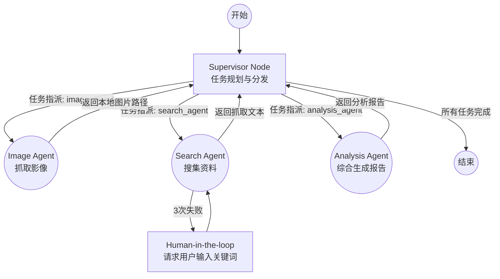

# 城市治理分析多智能体系统 (Urban Governance Multi-Agent System)

基于 **LangGraph** 构建的高级多智能体协作系统（Supervisor Pattern），专注于城市治理、区域发展规划与历史沿革的综合分析（例如：根据卫星影像和网络资讯分析特定区域如雄安新区、北邮沙河校区的发展建设情况）。

本项目采用了先进的**规划式重构 (Planning-based Supervisor)** 架构，通过一个核心的主管 (Supervisor) 智能体对复杂任务进行拆解、规划，并协调多个具备特定专业能力的子智能体 (Sub-agents) 共同完成任务。

## ✨ 核心特性

- 🧠 **Supervisor 规划机制**：主节点 (Supervisor) 首先将用户的宏大请求拆解为有序的任务列表（1. 2. 3. ...），并负责任务的分发与状态追踪，避免了模型在执行复杂任务时的迷失。
- 🤖 **多专家协同协作**：
  - **`image_agent` (图像智能体)**：专门负责获取并保存不同年份的卫星影像与地图数据。
  - **`search_agent` (搜索智能体)**：负责在互联网上精准搜索、抓取相关网页内容与新闻资料。
  - **`analysis_agent` (分析智能体)**：综合前序智能体收集到的所有原始多模态数据，进行深入分析并输出最终报告。
- 💾 **统一的共享记忆 (Shared Checkpointer)**：系统使用 Redis 作为共享 Checkpointer，主图与所有子图共享同一个数据连接与状态上下文，实现了完整的执行状态流转和记忆穿透。
- 🛡️ **高可用与错误恢复机制**：
  - **自动重试**：子智能体执行失败时，系统会自动进行最多 3 次的重试。
  - **Human-in-the-loop (人工介入)**：如果 `search_agent` 连续失败，系统会通过 LangGraph 的 `interrupt` 机制暂停，要求用户人工提供更准确的搜索关键词，然后无缝恢复执行。
- 📊 **高度可观测性**：每次状态变化都会在控制台打印美观的任务进度列表（包含 Pending、In Progress、Completed、Error 状态）及层级执行日志，便于调试。

## 🏗️ 架构设计

系统包含一个 Main Graph 和多个 Sub Graph，采用条件路由连接。



*（详细的架构演进对比请参考 `xiongan_agent/SUPERVISOR_ARCH.md`）*

## 📁 目录结构

```text
skill_aicoding/
├── xiongan_agent/
│   ├── supervisor.py              # 系统主入口与 Supervisor 图定义
│   ├── SUPERVISOR_ARCH.md         # 架构设计说明文档
│   ├── image_agent/               # 图像处理智能体模块
│   │   ├── image_agent_main.py    # Image Agent 子图构建
│   │   └── tool/                  # 图像抓取相关工具 (Google Earth, 高德, 百度等)
│   ├── search_agent/              # 搜索与抓取智能体模块
│   │   ├── search_agent_main.py   # Search Agent 子图构建
│   │   └── tool/                  # 搜索引擎与网页抓取工具 (DuckDuckGo, PDF转MD等)
│   └── analysis_agent/            # 数据综合分析智能体模块
│       └── analysis_agent_main.py # Analysis Agent 子图构建
└── xiongan_frontend/
    ├── langgraph.json             # LangGraph 图配置
    └── ui/                        # 前端 UI (Next.js)
```

## 🚀 快速开始

需要同时启动两个服务：**LangGraph API 服务器（后端）** 和 **Chat UI（前端）**，分别开两个终端窗口。

### 1. 环境准备

- **Python**: Python 3.9+
- **Node.js**: LTS 版本（从 https://nodejs.org 下载）
- **Redis**: 系统依赖 Redis 来保存执行状态 (Checkpointer)。
  请确保本地或远程服务器运行了 Redis 实例，例如通过 Docker 启动：
  ```bash
  docker run -d -p 6379:6379 redis-stack-server
  ```
- **配置环境变量**：确认项目根目录的 `.env` 包含以下内容：
  ```
  VLLM_MAIN_PORT=8002       # vLLM 主模型端口
  ANALYSIS_MODEL=remote     # analysis_agent 模型：remote（主模型）或 local（urban-vlm）
  ```
- **配置大模型 (LLM)**: 系统默认使用 VLLM 提供的 Qwen 模型。
  - 如果使用其他模型提供商，请修改 `xiongan_agent/supervisor.py` 及各个子 Agent 目录中的 `init_chat_model` 初始化配置。

### 2. 启动后端（LangGraph API 服务器）

#### 安装 langgraph-cli

```bash
pip install "langgraph-cli[inmem]"
```

#### 启动服务器

```bash
cd xiongan_frontend
langgraph dev --allow-blocking --host 0.0.0.0
```

启动成功后终端会打印：

```
🚀 API: http://0.0.0.0:2024
🎨 Studio UI: https://smith.langchain.com/studio/?baseUrl=http://0.0.0.0:2024
📚 API Docs: http://0.0.0.0:2024/docs
```

局域网内其他设备可通过 `http://<服务器IP>:2024` 访问。

> ⚠️ 开发服务器无鉴权，暴露到局域网前请确认环境安全。

### 3. 启动前端（Chat UI）

#### 安装 pnpm（首次，仅需一次）

```bash
npm install -g pnpm
```

#### 安装项目依赖（首次运行）

```bash
cd xiongan_frontend/ui
pnpm install
```

#### 启动开发服务器

```bash
pnpm dev
```

UI 默认运行在 `http://localhost:3000`。

### 4. 连接 Agent

浏览器打开 `http://localhost:3000`，填写连接参数：

| 参数 | 值 |
|---|---|
| Deployment URL | `http://localhost:2024`（局域网访问填 `http://<服务器IP>:2024`） |
| Graph ID | `agent` |
| LangSmith API Key | 本地运行留空 |

> Graph ID 必须填 `agent`（与 `langgraph.json` 中的 key 一致），填其他值会报 HTTP 422 错误。

点击 Connect 即可开始对话。

### 5. 可视化图结构

直接执行主程序入口文件可生成图结构：

```bash
cd xiongan_agent
python supervisor.py
```

脚本运行完毕后，会自动生成系统的图结构图，并保存为 `supervisor_graph.png`，您可以直接打开查看完整的状态机拓扑。

## 💡 典型执行流程示例

**用户提问**："请你根据2020和2025的卫星变化图，介绍北邮沙河校区近几年的发展"

1. **[规划]** Supervisor 解析请求，生成 3 步计划：
   - 任务 1: 获取 2020 和 2025 北邮沙河校区卫星影像 (分配给 `image_agent`)
   - 任务 2: 搜索北邮沙河校区 2020-2025 建设新闻 (分配给 `search_agent`)
   - 任务 3: 综合影像路径与新闻资料输出发展报告 (分配给 `analysis_agent`)
2. **[执行任务 1]** `image_agent` 被激活，调用工具下载图像，返回 `image_path` 回给 Supervisor。
3. **[执行任务 2]** `search_agent` 被激活，如果在抓取资料时反复失败（如遇到反爬），触发 `interrupt`，要求用户提供强制搜索关键词；拿到新词后重试并成功。
4. **[汇总任务 3]** Supervisor 将前两步的结果拼接进上下文，分配给 `analysis_agent`。
5. **[输出报告]** `analysis_agent` 完成最终思考与排版，输出深度报告。
