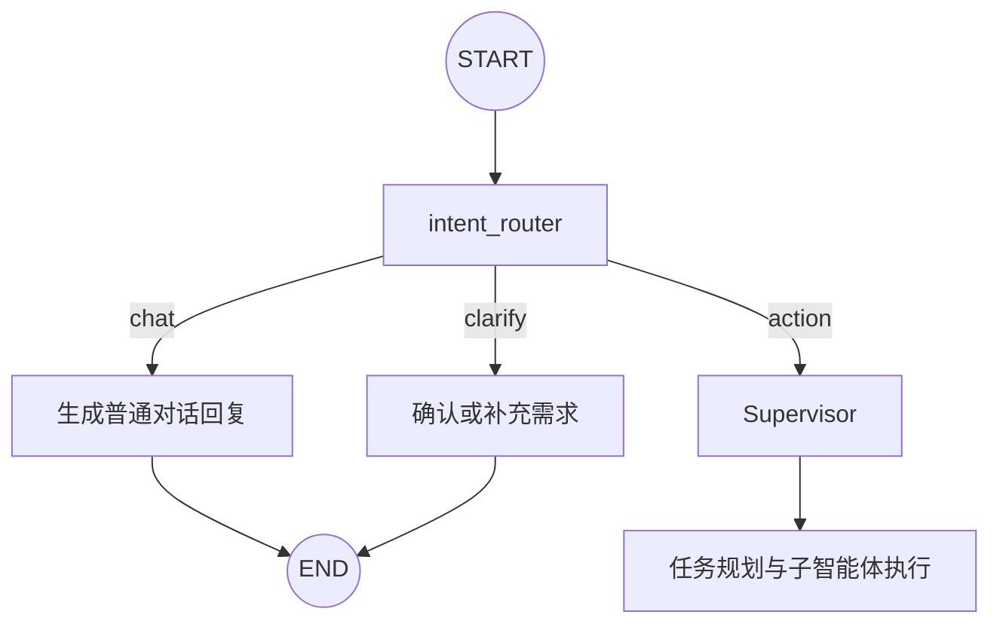

# 用户需求确认与普通对话路由说明

本文记录本项目如何解决以下问题，并给出 UrbanAgent 可复用的实现方案：

- 用户输入 `1`、乱码或空内容时，智能体不应原样复读；
- 用户问“你是谁”“啥情况”时，不应重复同一句固定模板；
- 信息不足的分析请求应先确认需求；
- 普通聊天不应启动耗时的搜索、影像和分析流程；
- 明确任务才进入 Supervisor 规划。

## 问题背景

最初所有消息都会直接进入 Supervisor 或规划模型，产生过以下错误行为：

```text
用户：1
助手：1

用户：你是谁
助手：你好像还没有输入具体内容……

用户：啥情况
助手：你好像还没有输入具体内容……
```

根因是系统把“聊天”“无效输入”“需要补充信息的任务”和“可直接执行的任务”混在同一个规划节点中处理。规划模型擅长拆解任务，但不适合作为所有对话的第一响应节点。

## 当前架构

本项目在主图入口增加了独立的 `intent_router`：



对应代码：

```text
xiongan_agent/supervisor_agent/supervisor_agent_main.py
```

核心函数：

```python
_latest_human_text()
_is_obviously_invalid_input()
_invalid_input_clarification()
intent_router_node()
route_after_intent()
```

## 三类意图

### `action`

用户已经给出明确的查询、分析、搜索、图片识别或城市治理任务。

示例：

```text
分析雄安新区2020年和2025年的城市变化。
搜索雄安新区最近的交通建设进展。
对比这两张卫星影像中的新增建筑。
```

路由结果：

```json
{"type": "action"}
```

系统会清空旧任务计划状态，并进入 Supervisor。

### `chat`

无需工具和任务规划的普通交流。

示例：

```text
你好
你是谁
你能做什么
啥情况
```

路由结果：

```json
{
  "type": "chat",
  "reply": "自然、结合上下文的中文回复"
}
```

回复写入消息历史后，本轮直接结束，不启动搜索或分析。

### `clarify`

输入没有有效语义，或任务意图存在但执行条件不足。

示例：

```text
1
???
帮我分析一下
看看这个
```

路由结果：

```json
{
  "type": "clarify",
  "question": "结合用户原话提出一个简短确认问题"
}
```

本轮结束，等待用户补充。下一轮会携带最近对话上下文再次进入意图路由。

## 为什么使用“规则 + 模型”两层判断

完全依赖模型会存在不稳定性。纯数字、空白和乱码有时会被模型复读，有时会被误判为任务。因此本项目先使用确定性规则拦截明显无效输入：

```python
def _is_obviously_invalid_input(text: str) -> bool:
    compact = re.sub(r"\s+", "", text)
    if not compact or compact.isdigit():
        return True
    return re.search(r"[\u4e00-\u9fffA-Za-z]", compact) is None
```

处理顺序是：

1. 读取最新一条用户消息；
2. 确定性规则拦截空内容、纯数字和无文字乱码；
3. 其余输入交给模型判断 `action/chat/clarify`；
4. 对模型输出做 JSON 解析和兜底；
5. 决定结束本轮还是进入 Supervisor。

规则只处理“明显无效”，不要通过关键词规则判断所有意图，否则“帮我看看”“这个怎么回事”等依赖上下文的表达容易被误伤。

## 消息兼容处理

LangGraph API 不同版本返回的消息对象类型可能不同。不能只写：

```python
isinstance(message, HumanMessage)
```

当前实现同时识别：

- `HumanMessage`；
- `message.type == "human"`；
- `message.role == "user"`；
- 字典形式的 `type`、`role` 和 `content`；
- 字符串内容；
- `text`、`input_text` 内容块。

这样可以避免升级 LangGraph API 后“明明有用户输入，却读取为空”的问题。

## 上下文与连续确认

意图模型会接收最近 8 条消息：

```python
recent_messages = state.get("messages", [])[-8:]
```

这使下面的连续对话能够被正确理解：

```text
用户：帮我分析一下。
助手：你希望分析哪个地区，以及关注什么时间范围？
用户：雄安新区，2020到2025年。
```

第二条用户消息不应被当成孤立文本，而应结合上一轮确认问题判定为 `action`。

不要把全部历史无限传给路由模型：

- 会增加响应时间；
- 会增加 token 消耗；
- 很早以前的话题可能干扰当前意图；
- 路由只需要最近几轮上下文。

## 避免死板回复

“无效输入”和“普通聊天”不能共用同一个固定兜底文案。

当前策略：

- 明显无效输入：规则生成针对性的确认话术；
- 普通聊天：由模型根据上下文自然回复；
- 模型没有给出回复：使用普通对话兜底；
- 模型复读用户原文：改为确认问题；
- JSON 解析失败：默认进入 `clarify`，不直接启动复杂任务。

示例：

```text
用户：1
助手：你刚才输入的是“1”，是不是输错了？你可以直接告诉我想聊什么，
或者说明需要分析的地区和问题。

用户：你是谁
助手：我是城市治理分析智能体，可以和你普通聊天，也可以调用影像、搜索
和分析工具研究一个地区的发展变化。
```

## 状态设计

主状态中增加：

```python
intent_route: Literal["action", "chat", "clarify"]
```

路由节点返回时同时设置：

```python
{
    "intent_route": "chat",
    "next_step": "end",
    "messages": [AIMessage(content=reply)],
}
```

明确任务进入 Supervisor 前，需要重置上一次任务执行状态：

```python
{
    "intent_route": "action",
    "task_plan": [],
    "current_task_index": 0,
    "next_step": "supervisor",
    "retry_count": 0,
}
```

否则同一线程中的新任务可能错误继承旧任务进度。

## 图连接方式

节点注册：

```python
workflow.add_node("intent_router", intent_router_node)
workflow.add_node("supervisor", supervisor_node)
```

入口和条件边：

```python
workflow.add_edge(START, "intent_router")
workflow.add_conditional_edges(
    "intent_router",
    route_after_intent,
    {
        "supervisor": "supervisor",
        END: END,
    },
)
```

其中：

```python
def route_after_intent(state):
    return "supervisor" if state.get("intent_route") == "action" else END
```

`chat` 和 `clarify` 的回复已经由 `intent_router` 写入消息，所以可以直接结束本轮。

## UrbanAgent 迁移建议

UrbanAgent 可以在现有 Supervisor 前增加同样的意图确认节点：

1. 在状态中增加 `intent_route`；
2. 增加“读取最新用户消息”的兼容函数；
3. 先用确定性规则拦截空白、纯数字和乱码；
4. 用轻量模型将其余消息分类为 `action/chat/clarify`；
5. `chat` 直接自然回复；
6. `clarify` 提出一个具体问题后结束本轮；
7. 只有 `action` 进入原有规划器；
8. 进入规划器前清空旧的 task plan、索引和重试状态；
9. 使用最近 6 至 10 条消息支持连续确认；
10. 保留 Supervisor 内部的二次校验，防止旧入口或测试脚本绕过路由节点。

如果 UrbanAgent 已经有意图确认节点，应重点对比：

- 是否把普通聊天误判为信息不足；
- 是否把纯数字直接交给模型；
- 是否读取了最近对话上下文；
- 是否在 `action` 时重置旧任务状态；
- 是否兼容 LangGraph API 的协议消息对象；
- 模型返回空内容、错误 JSON 或复读时是否有兜底；
- `clarify` 后是否真正结束当前运行并等待下一条用户消息。

## 推荐测试用例

### 明显无效输入

```text
""
"   "
"1"
"12345"
"!!!"
"……"
```

预期：`clarify`，不得复读作为助手答案，不得生成任务计划。

### 普通聊天

```text
"你好"
"你是谁"
"你能做什么"
"啥情况"
"谢谢"
```

预期：`chat`，回复应结合语境且不启动工具。

### 信息不足

```text
"帮我分析一下"
"看看这个地区的发展"
"对比一下变化"
```

预期：`clarify`，只询问最关键的缺失条件，不一次提出过多问题。

### 明确任务

```text
"分析雄安新区2020年和2025年的城市变化"
"搜索雄安新区2025年的交通建设进展"
```

预期：`action`，进入 Supervisor 并生成任务计划。

### 连续确认

```text
用户：帮我分析一下。
助手：请问需要分析哪个地区和时间范围？
用户：雄安新区，2020到2025年。
```

预期：第二轮进入 `action`，不应再次询问地区和年份。

### 线程内新任务

先完成一个任务，再输入：

```text
再帮我分析容东片区2021到2025年的变化。
```

预期：生成全新的任务计划，不继承上一轮的完成状态。

## 与来源编号方案的关系

意图路由负责决定“是否执行复杂任务”，来源编号处理负责保证“复杂任务最终报告的证据对应关系”。两者都应该在后端图中完成：

- 前端只能改善展示，不能决定用户意图；
- 前端也不能安全地重建正文引用与来源的对应关系；
- UrbanAgent 应同时复用入口意图路由和最终报告引用归并方案。

来源编号方案见：

```text
REPORT_SOURCE_NUMBERING.md
```

