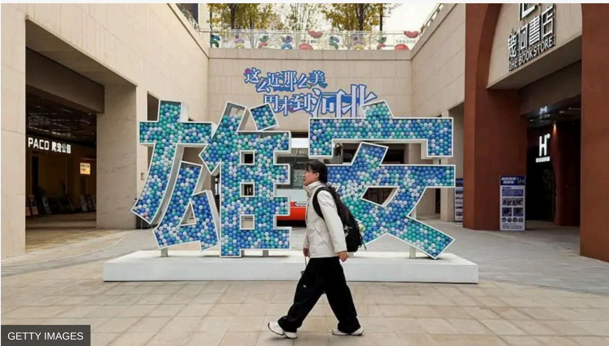
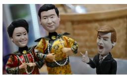
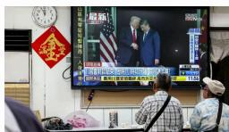
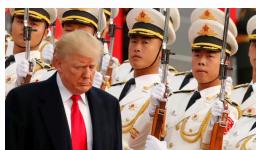
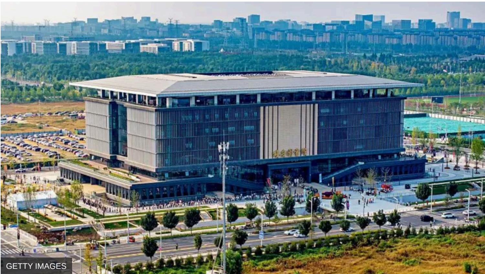
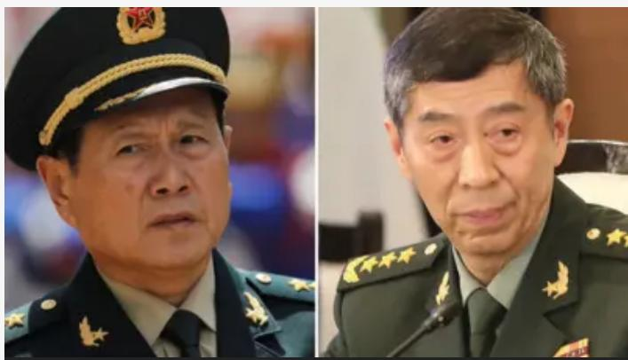
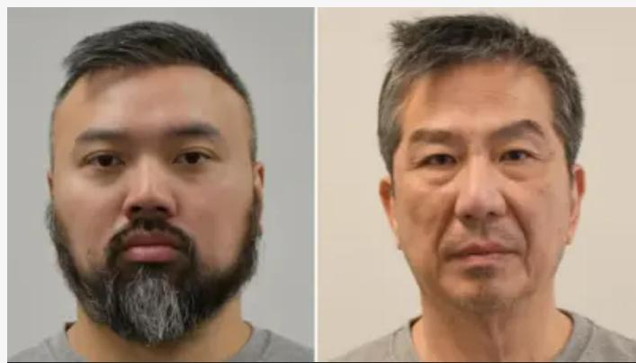
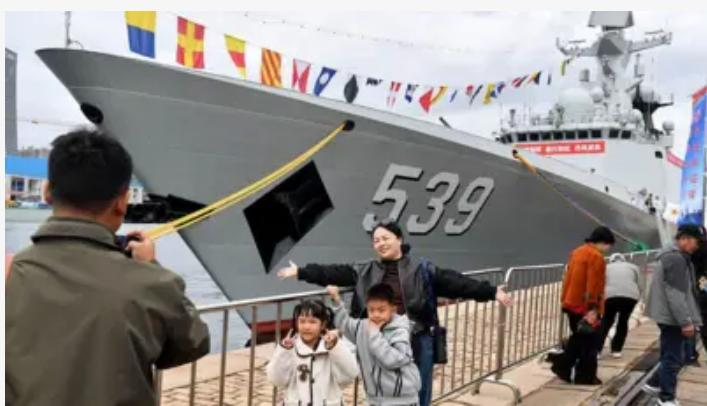
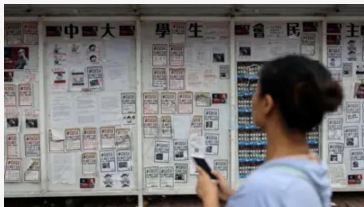
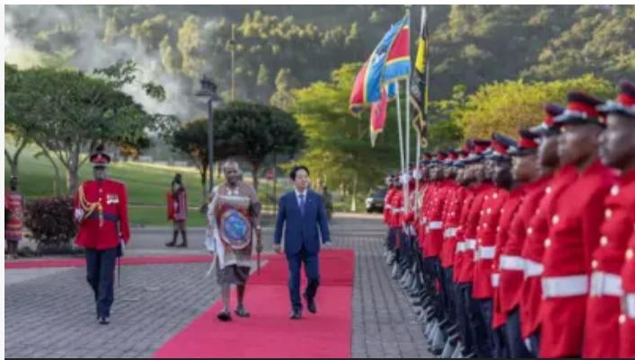

# 雄安新区十年：领导人“个人设想”、洪水争议与“疏解”暗战

text_image

这么近那么美
周末到河北
农家
PACO 鬼宠公园
老口書店
DIRE BOOK STORE
H
GETTY IMAGES

2026年3月，中国全国两会刚刚结束，习近平再次前往雄安新区考察。

这也是习近平第四次到访这座位于河北、距离北京100多公里的新区。若从2016年3月“雄安新区”在中共政治局常委会上定名算起，这座新城的设立，至今正好走过十年。

更被外界所记住的，是一年后的那个愚人节。2017年4月1日，新华社受权发布消息，中办国办通知决定设立河北雄安新区。由于此前相关消息一直高度保密，通知来得突然，以至于大量民众，乃至部分地方官员，起初将其当作玩笑。

这种错愕只持续了数小时。随后，购房中介连夜驱车涌入雄县、容城、安新三地，挨家挨户敲门谈价。房价在数小时内翻倍。地方政府在约48小时内完成了反应：冻结全部房产过户，关停售楼处与中介机构。

从一开始，雄安就不是一个普通的城市开发项目。它更像是习近平上任初期提出的高度具象化、同时也高度政治化的国家工程。也正因如此，过去十年间，围绕雄安的讨论始终带着一种少见的复杂性。

官方的表述是宏大的：雄安是继邓小平及江泽民时代的深圳特区、上海浦东新区之后，又一具有全国意义的新区，是“千年大计、国家大事”。

可在日常公共讨论里，它又常常并不处在舆论中心。真正持续关注它的人，往往不是普通网民，而是可能被迫迁往当地的北京央企员工、大学教师和医院职工。

另一重复杂性，则体现在视觉呈现与现实疑虑之间的落差。无论是官方媒体，还是一些自媒体的实地探访视频，雄安都展现出一种强烈的未来感：楼宇整齐、绿地开阔、基础设施崭新，生态与科技几乎成了它最鲜明的标签。它被反复描述为一座“未来之城”。

# 热读

特朗普訪華前瞻：貿易、科技、台灣和伊朗四大焦點，美中各自希望得到什麼

美國會否改口「反對」台獨？特朗普訪華前夕台灣陷「菜單焦慮」

從「何劍」到台灣 盤點特朗普訪華啟程前中美輿論場上的「叫板」熱點

化學元素週期表會有完成的一天嗎？

但与此同时，另一种叙事也始终没有消失。在不少评论和视频中，人们不断追问它的入住率、人口密度和真实活力，并由此引出更尖锐的问题：这座城市最终会成为下一个深圳，还是沦为一座被行政力量强行托举的“鬼城”样本？

欧洲的中国研究机构墨卡托中国研究中心（MERICS）分析师亚历山大·戴维（Alexander Davey）接受BBC中文采访时给出了一个不同的切入角度：“（中国）国内那些‘千年大计’、‘历史性考验’的宏大叙述，确实往往让外部读者感到悬浮。但真正重要的是，中共高层对‘高效城市’的定义，本来就不同于西方常见的市场标准。对党（中共）而言，雄安的关键不在于它是否首先表现出自发的商业热度，而在于它能否承接被转移而来的人口、机构和功能，并同时成为一个以战略性新兴产业为核心、由政策驱动的创新示范区。”

这样说来，争论双方看的似乎根本不是同一把尺子。

BBC中文梳理了这十年来围绕这一工程的若干关键问题，尝试更完整地呈现它的进展与争议。

natural_image

Exterior view of a modern multi-story building with parking lot and city skyline in background (no signage visible)

2025年10月拍摄的雄安图书馆。2019年习近平第二次考察雄安，要求启动一批标志性工程，让各界看到实质变化。

# 习近平的“个人设想”和“政治遗产”

美国前财政部长保尔森在回忆录《与中国打交道》（Dealing with China）中记录了一次耐人寻味的私下谈话。

2014年7月，他与习近平会面，习明确告诉他，推进京津冀协同发展，是“他个人的设想”，并将其视为未来的政治遗产之一。彼时，“雄安新区”这个名字尚未出现。两年后，这一设想最终落定。

京津冀区域合作在中国政策版图中早有渊源。早在2004年，相关规划就已启动，但当时仅停留在国家发改委层面。这份区域规划报国务院之后，在胡锦涛、温家宝执政的十年间，始终未能正式出台。习近平上台后，这一战略的政治地位迅速提升。2014年，他主持专题座谈会，明确将京津冀协同发展定性为重大国家战略——也正是在同一年，他向保尔森说出了那句“个人的设想”。

习近平对雄安的重视，不只体现在视察的频次上，更体现在每次视察所传递出的政治信号的分量上。九年间四度亲赴雄安，无论在他执政生涯的个人记录里，还是在中国任何一个城市发展所受到的最高层关注程度上，都属罕见。

2017年2月，他首次视察雄安，提出这里是“留给子孙后代的历史遗产”，要坚持“世界眼光、国际标准、中国特色、高点定位”。值得关注的是，他在这次视察中强调必须先把规划做好、再动工建

设，由此让雄安进入了长达两年的建设沉寂期。2019年1月，他再次到访，提出要保持“历史耐心”和“战略定力”，同时要求启动一批标志性工程，让各界看到实质变化。

这之后，雄安进入了快速建设阶段——雄安高铁站、容东片区、国贸中心项目在此后四年内相继落成。2023年，习近平在新冠封控解除后不久赴雄安考察，提出新区已进入“大规模建设与承接北京非首都功能疏解并重”的新阶段，宣告建设重心的切换。

而在刚刚结束的第四次考察中，他将定性的调门提到了前所未有的高度，明确表示“实践充分证明，党中央关于建设雄安新区的决策是完全正确的”。

长期观察中共政治的分析人士、前驻华记者利明璋（Bill Bishop）撰文指出，这一表态在中共语境中具有高度明确的政治含义。它是向体制内所有怀疑者发出的清晰信号：任何对雄安前景持保留态度的声音，在政治上都是危险的。

在他看来，这是习近平以最高权威对雄安进行的一次政治背书与保护。

戴维也认为，雄安之所以具有如此厚重的政治分量，在于它已成为习近平领导下京津冀整体战略的核心棋子。它对习近平政治遗产的意义，不仅在于这座城市本身是否最终建成，更在于它能否被呈现为党有能力设计并执行宏大长期规划的有力证明。

GETTY IMAGES

在官方叙事中，与雄安新区并肩而立的是深圳特区和上海浦东。它们分别在1980年代和1990年代，成为彼时中国最重要的经济引擎，也各自留下了那个时代最具代表性的话语。

深圳的标志口号是“时间就是金钱，效率就是生命”，以及举国熟知的“深圳速度”。这背后的核心是改革，即用市场逻辑打破计划经济的僵局，强调效率。浦东的定位则是“站在地球仪旁，思考浦东开发”，它的核心是开放，即把上海重新接入全球市场，让外资、外贸与国际规则一同涌进来。

深圳和上海，恰好各自承载了那个时代最关键的两个主题：改革与开放，。

然而雄安的关键词，从一开始就不是改革，也不是开放，而是疏解。

准确地说，是疏解北京的“非首都功能”。这意味着，雄安所承担的历史任务，与深圳和浦东在根本逻辑上截然不同。后两者是“从无到有”的创造，是增量的生长；而雄安更像是一次存量的再分配——把北京积累了数十年的人口、机构、功能与资源，有计划地重新摆放到华北平原更大的空间里去。

1978年，中国GDP前十强中北方城市占据六席。到了当下，前十强里只剩北京一座北方城市。

而北京本身也已被“大城市病”压得喘不过气。北京中心城区不到全市8%的面积，集聚了接近80%的常住人口，早晚高峰的通勤压力常年位居全国前列。即便北京早已成为全中国门槛最高的落户城市，这种张力依然没有得到根本缓解。

在这样的背景下，雄安被设计出来，承接北京溢出的压力。但疏解的难度，远比当年建设深圳和浦东复杂得多。

把一家央企总部的牌子挂到雄安并不困难。难的是把一个个家庭也移过去。

戴维认为，将北京非首都功能迁移至雄安，是一个国家主导的计划性过程，而非由市场机遇所驱动。行政命令迁移机构相对顺畅——例如中国中化、中化新能源、中国华能这类央企总部，以及大学、医院等公共服务机构——但要让个体真正自愿迁移，仅凭命令远远不够。

对于一个生活在北京的家庭来说，南迁雄安往往意味着放弃一整套与北京户口深度捆绑的利益结构：孩子在北京入学的资格、夫妻双方的就业网络、已经买下的房产，以及那张含金量远超其他城市的医保和社保。

这也催生了一种“软抵抗”。它通常不会出现在官方报道里，而更多地流动在网络评论、同事饭局和私底下的抱怨之中。2023年，习近平在雄安相关座谈会上的一段措辞，将这种暗流拉到了台面上。他明确提出：不能凭自身好恶，需要搬就得搬；不能搞“纸面疏解”、变相回流，名义上疏解

了，结果回去了；更不能通过在北京设立二级单位等方式，边疏解边新增。这段话几乎是在逐条描述企业拖延疏解的惯用套路。

2025年3月，有报道记录了一位在雄安工作近三年的国企员工的日常节奏——周一早上从北京西站乘京雄城际出发，周五下班后原路返回。从北京西站到雄安站，最快不到一小时，每天最多可达19趟列车，这套精心设计的交通安排，在客观上为“双城候鸟”式的生活提供了充分的基础设施支撑。到2026年2月，北京媒体进一步记录了更系统性的通勤图景：越来越多的员工选择工作日驻留雄安、周末返京。驱动他们保持这种节奏的理由，几乎总是相同的——孩子的学校、配偶的单位，以及整个家庭仍然绑定在北京。

他们被称为“周末京雄候鸟”。而这种现象，恐怕还将在未来相当长的时间里，成为雄安发展必须正视和解决的核心难题之一。

戴维说：当激励政策未能产生预期的人口流动时，强制手段便随之而来。

# GETTY IMAGES

雄安新区水体生态优美，但洪水也成为重要的风险。

# 泄洪的选择

如果说“疏解”所制造的张力，是人与人之间利益的摩擦，那么紧邻雄安的白洋淀，呈现的则是人与自然之间的张力。

雄安新区毗邻白洋淀，这片华北平原上最大的淡水湖泊赋予了新区独特的生态优势，也构成了官方规划中“蓝绿交织”愿景的核心。

但在水文学的意义上，白洋淀本身带有天然的不稳定性：它是大量支流的汇入地，也是整个华北平原最重要的天然蓄洪区之一。华北一旦遭遇大水，这些河流将依照重力与地势，将洪峰导向这里。

在雄安宣布成立的最初几年，中国科学院组织的专家评估就已明确提出，新区面临高洪水风险等重大问题。评估报告的结论直白而具体：若雄安人口扩张至500万规模，在百年一遇的洪水情境下，新区已开发区域的近一半将面临被淹风险。这一警告写入了学术文献，但并未改变习近平的决定。

这份风险评估真正接受考验，是在2023年7月底。台风“杜苏芮”带来的超强降雨席卷华北，北京录得140年以来最强降水。

应对这场洪灾时，官员们的公开表态清晰呈现了决策的优先排序：河北省委书记将雄安新区明确列为全省防洪工作的“重中之重”；水利部部长公开表示，要制定分洪方案，确保北京与雄安新区的安全，并将两者直接点名为保护重点。

在这样的优先排序之下，位于北京与雄安之间的涿州市承受了沉重代价。这座拥有约60万人口的城市遭受了灾难性内涝，大量居民事后反映，洪水到来之前几乎没有收到预警，部分人仅提前数小时接到通知。

水利部部长李国英后来在官方媒体上也直接承认：如果没有涿州和蓄滞洪区拦截洪水，下游雄安和天津所面临的防洪压力将“非常沉重”。

洪水退去后，涿州部分受灾居民聚集于政府门口，手持横幅要求赔偿。其中一条横幅上写道：“还我家园，洪水不是天灾，是人祸放水所致。”

# GETTY IMAGES

建设中的雄安新区

# 2035年成败见分晓?

中国官方为雄安成效设定了两个时间节点。2035年，基本建成绿色、智能、宜居的现代化城市，具备较强竞争力，实现人与自然和谐共存；到本世纪中叶，成为京津冀世界级城市群的重要一极，有效承接北京的非首都功能，为解决“大城市病”提供“中国方案”。

具体到2035年，雄安的规划人口目标是200万到250万。当前常住人口约为150万，这意味着在未来九年内，还需要有近百万人迁入雄安。

但这并不是一件容易的事。除了让100万人真正愿意迁入，另一个问题则更加现实：钱从哪里来。河北省公布的数据显示，仅“十四五”这五年，雄安新区已累计投入约1万亿元人民币；若按每年约2000亿元的节奏推算，到2035年还将再投入近2万亿元。而雄安明确摒弃了土地财政，甚至取消了广受诟病的商品房预售制，改为现房销售。这意味着它从一开始就封堵了中国城市建设最主要的“造血”通道。那么，这笔巨大的资金缺口，究竟是由中央财政持续买单，还是另有解法？目前仍是一个悬而未决的问题。

2035年，还有另一层值得深入理解的政治含义。中共历来习惯于设立超长期的政治节点。中共确立的“两个一百年”目标中，包括在中华人民共和国成立百年的2049年全面建成社会主义现代化强国。这套叙事框架延续多年，直至习近平上台后做出了一个微妙的调整。

2049年，习近平将已年届96岁。于是，他在两个既有节点之间插入了一个新的中间节点——2035年，要求“基本实现社会主义现代化”，经济上人均GDP达到中等发达国家水平。这一目标若能实现，意味着中国届时极可能已超越美国，成为全球第一大经济体。而那一年习近平82岁。

此后，2035年在观察中国的分析人士中间反复出现。普遍的看法是，这个被人为楔入的时间节点，背后最深层的意义，是习近平在执政生涯最后阶段完成历史总结的高光时刻。雄安新区2035年的建成目标，也正是在这一思路下嵌入了整个政治叙事。

然而，戴维认为，对雄安成功与否真正构成考验的，不是建了多少基础设施，也不是有多少企业签署了入驻协议，而是那些央企能否将核心职能真正迁来，能否在这片土地上生长出真实的创新成果与技术突破。而制约这一切的关键，在于雄安能否成为高水平人才真正愿意生活的地方，而不只是一个短暂驻留、然后返回北京的过渡站。

戴维认为，雄安面临的一大风险就是它始终停留在一个由政治力量精心打造的“展示橱窗”，而无法成长为能够自我维系的创新枢纽。

“习近平试图将它建成一座未来模范城市，更广泛地说，是党对‘中国城市未来应有形态’之构想的具体呈现。这赋予了这个项目远超任何单一领导人个人遗产的深远意义。如果它成功，将可能成为一个可在全国复制推广的模板；如果它失败，则将彻底暴露单纯依靠自上而下的顶层设计来打造创新活力与城市生机的根本局限。”

# 更多相关内容

# 中国宣布的雄安新区是怎么一回事？

2017年4月3日

# 英媒：中国雄安新区能否成功受质疑

2017年4月27日

# 英媒：中国打造雄安新区令纽约黯然失色

2017年4月7日

英媒：北京专家透露雄安新区规划内幕

2017年6月7日

首都定在这里还是那儿？各国考量各有千秋

2017年12月8日

海南自贸岛的雄心和
忧虑

2020年6月22日

# 头条新闻

特朗普访华前瞻：贸易、科技、台湾和伊朗四大焦点，美中各自希望得到什么

8小时前

从“何剑”到台湾 盘点特朗普访华启程前中美舆论场上的“叫板”热点

2026年5月11日

特朗普称伊朗终战提案“完全不可接受”，油价再度上涨

9 小时前

特别推荐   

natural_image

Two military officers in uniform, one with a star emblem and the other with a star insignia (no visible text or symbols)

魏凤和、李尚福被判死缓 中国两任前国防部长因贪污腐败下狱

2026年5月7日

natural_image

Side-by-side comparison of a man's head and face, showing both male and female subjects with no visible text or symbols.

伦敦香港经贸办案：卫志梁、袁松彪为中国情报部门工作，违反英国国安法罪成

2026年5月7日

natural_image

Exterior view of a modern naval warship with hull number 539, surrounded by people posing in front (no visible text or symbols on the ship itself)

中国发布东海海底科研报告 展示“军民融合”战略巨大弹性

2026年5月6日

text_image

中大學生會民主

香港后国安法时代：当大学不再是“保护伞”，夹缝中的学生还能做什么？

2026年5月5日

natural_image

Official welcome ceremony with dignitaries walking on a red carpet, flanked by honor guards in uniform and flags (no visible text or symbols)

秘密抵达、事后宣布——赖清德突围出访史瓦帝尼，台湾扳回一城了吗？

2026年5月4日

# 热门内容

1 特朗普訪華前瞻：貿易、科技、台灣和伊朗四大焦點，美中各自希望得到什麼  
2 美國會否改口「反對」台獨？特朗普訪華前夕台灣陷「菜單焦慮」  
3 從「何劍」到台灣 盤點特朗普訪華啟程前中美輿論場上的「叫板」熱點  
4 化學元素週期表會有完成的一天嗎？  
5 特朗普稱伊朗終戰提案「完全不可接受」，油價再度上漲

6 施紀賢英國首相地位岌岌可危 工黨權力爭奪戰的七個可能  
7 大衛·艾登堡爵士百歲：BBC
紀錄片宗師如何塑造了「綠色好萊塢」  
8 BBC調查：朝鮮為俄羅斯出戰陣亡了多少士兵？  
9 足球世界盃：央視轉播權為何難以敲定？中國人還會熬夜看球嗎？  
10 台灣醫美巨頭愛爾麗涉「系統性偷拍」，數以百計女性憂私密影片外流

BBC值得信赖的原因

<table><tr><td>使用条款</td><td>Cookies</td><td>以其他语言阅览BBC新闻</td></tr><tr><td>隐私政策</td><td>联络BBC</td><td>Do not share or sell my info</td></tr></table>

© 2026 BBC. BBC对外部网站内容不负责任。阅读了解我们对待外部链接的做法。